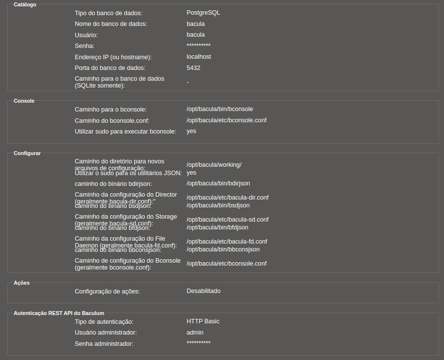
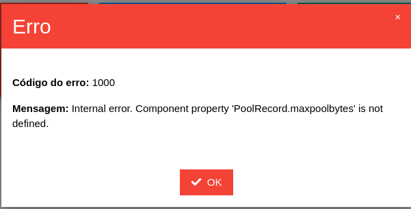

# Install Bacula 13 in Debian 11

## Additional Package Installation

    apt update && apt -y install software-properties-common ca-certificates lsb-release apt-transport-https gnupg

## Import the GPG key

    wget https://www.bacula.org/downloads/Bacula-4096-Distribution-Verification-key.asc
    
    apt-key add Bacula-4096-Distribution-Verification-key.asc

    apt-key export E9DF3643 | gpg --dearmour -o /etc/apt/trusted.gpg.d/bacula.gpg --yes
    
    rm Bacula-4096-Distribution-Verification-key.asc

## `apt` Package Manager Configuration

### Create a new sources list file:

    /etc/apt/sources.list.d/Bacula-Community.list

### and write the following repositories in it
    
    #Bacula Community
    deb [arch=amd64] https://bacula.org/packages/5f1e8eefd1016/bacula/debs/13.0.1 bullseye main

### Install bacula

* Mysql

        apt update && apt -y install bacula-mysql php-mysql

* Postgresql

        apt update && apt -y install bacula-postgresql php-pgsql 

# Install Baculum in Debian 11

## Import the public key into the APT trusted key list:

    wget -qO - http://www.bacula.org/downloads/baculum/baculum.pub | apt-key add -
    
    apt-key export 5C3DBD51 | gpg --dearmour -o /etc/apt/trusted.gpg.d/baculum.gpg --yes

## Create a new sources list file:

    /etc/apt/sources.list.d/baculum.list

## and write the following repositories in it

    deb http://www.bacula.org/downloads/baculum/stable-11/debian bullseye main
    deb-src http://www.bacula.org/downloads/baculum/stable-11/debian bullseye main

## Baculum API

### Baculum API with Apache web server

    apt update && apt -y install php-bcmath php-dom php-mbstring php-curl php-ldap baculum-common baculum-api baculum-api-apache2

#### After installation you must enable the rewrite Apache module:

    a2enmod rewrite

#### There is also required to enable the baculum-api virtual host site:

    a2ensite baculum-api

#### At the end please restart (or reload) the new Apache web server configuration:

    systemctl restart apache2

### ou Baculum API with Lighttpd web server

    apt update && apt -y install php-bcmath php-mbstring php-curl php-dom php-ldap baculum-common baculum-api baculum-api-lighttpd

#### After installation please start the Lighttpd web server:

    systemctl start baculum-api-lighttpd

### Permissões

#### Create a new sources list file:

    /etc/sudoers.d/baculum-api

#### and write the following repositories in it

    Defaults:www-data !requiretty
    www-data ALL = (root) NOPASSWD: /opt/bacula/bin/bconsole
    www-data ALL = (root) NOPASSWD: /opt/bacula/bin/bdirjson
    www-data ALL = (root) NOPASSWD: /opt/bacula/bin/bsdjson
    www-data ALL = (root) NOPASSWD: /opt/bacula/bin/bfdjson
    www-data ALL = (root) NOPASSWD: /opt/bacula/bin/bbconsjson
    www-data ALL = (root) NOPASSWD: /usr/bin/systemctl start bacula-dir
    www-data ALL = (root) NOPASSWD: /usr/bin/systemctl stop bacula-dir
    www-data ALL = (root) NOPASSWD: /usr/bin/systemctl restart bacula-dir
    www-data ALL = (root) NOPASSWD: /usr/bin/systemctl start bacula-sd
    www-data ALL = (root) NOPASSWD: /usr/bin/systemctl stop bacula-sd
    www-data ALL = (root) NOPASSWD: /usr/bin/systemctl restart bacula-sd
    www-data ALL = (root) NOPASSWD: /usr/bin/systemctl start bacula-fd
    www-data ALL = (root) NOPASSWD: /usr/bin/systemctl stop bacula-fd
    www-data ALL = (root) NOPASSWD: /usr/bin/systemctl restart bacula-fd

## Baculum Web

### Baculum Web with Apache web server

    apt update && apt -y install baculum-common baculum-web baculum-web-apache2

#### After installation you must enable the rewrite Apache module:

    a2enmod rewrite

#### There is also required to enable the baculum-web virtual host site:

    a2ensite baculum-web

#### At the end please restart (or reload) the new Apache web server configuration:

    systemctl restart apache2

### ou Baculum Web with Lighttpd web server

    apt update && apt -y install baculum-common baculum-web baculum-web-lighttpd

#### After installation please start the Lighttpd web server:

    systemctl start baculum-web-lighttpd

## Configurações:

## Obs:

### Erro 01:

` Código do erro: 1000 Mensagem: Internal error. Component property 'PoolRecord.maxpoolbytes' is not defined. `

### Resolução 01:

    # Insert line
    public $priorjob;
    /usr/share/baculum/htdocs/protected/API/Class/JobRecord.php
    
    # Insert line
    public $maxpoolbytes;
    /usr/share/baculum/htdocs/protected/API/Class/PoolRecord.php

    systemctl restart apache2